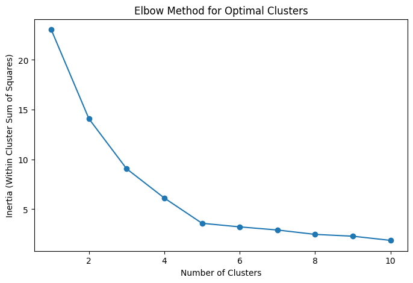
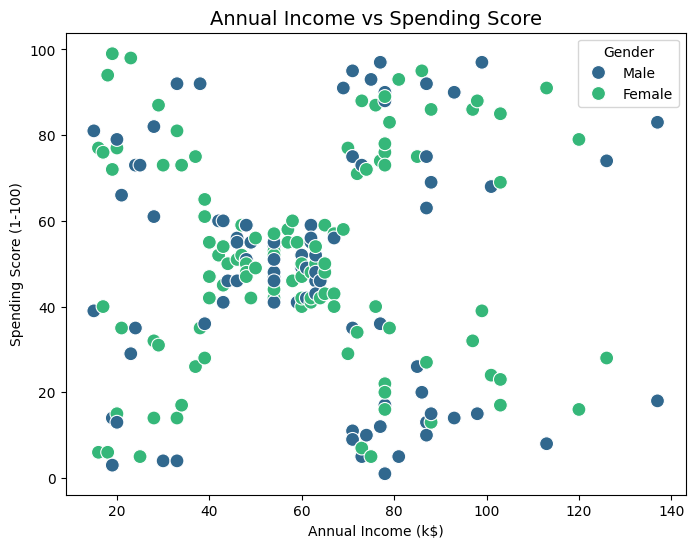

# Mall Customer Segmentation

This project uses K-means clustering to segment mall customers based on their annual income and spending behavior. The goal was to identify distinct customer groups and provide actionable business insights for targeted marketing strategies.

## Introduction
I chose this project to deepen my understanding of customer segmentation and clustering techniques. It was an exciting opportunity to combine exploratory data analysis and machine learning to derive actionable business insights. Through this project, I learned how to preprocess data, apply the K-means algorithm, and interpret the results for practical applications.

## Key Highlights
- Performed exploratory data analysis (EDA) with insightful visualizations.
- Applied K-means clustering with the Elbow Method to determine the optimal number of clusters.
- Provided actionable business insights for each customer segment.



## Tools Used
- Python (Pandas, Matplotlib, Seaborn, Scikit-learn)

## Results
The clustering process revealed interesting customer behavior:
1. Low-income, low-spending customers.
2. High-income, high-spending customers.
3. Low-income, high-spending customers.
4. High-income, low-spending customers.

One surprising finding was the distinct cluster of low-income but high-spending customers. This highlights the importance of not solely relying on income to predict spending habits, as there might be other influencing factors like lifestyle or preferences.

## Business Recommendations

Based on the clustering results, here are actionable strategies that businesses can implement:

1. **Cluster 0 (Low-income, low-spending customers):**
   - Strategy: Offer budget-friendly deals and discounts to attract this price-sensitive group.
   - Goal: Increase spending and build loyalty with cost-effective products.

2. **Cluster 1 (High-income, high-spending customers):**
   - Strategy: Focus on premium product lines, exclusive memberships, and personalized experiences.
   - Goal: Retain these high-value customers and enhance their brand loyalty.

3. **Cluster 2 (Low-income, high-spending customers):**
   - Strategy: Provide promotional offers and flexible payment plans to maintain their spending habits.
   - Goal: Build a strong relationship and ensure customer retention.

4. **Cluster 3 (High-income, low-spending customers):**
   - Strategy: Highlight the quality and value of products through educational marketing.
   - Goal: Encourage cautious spenders to purchase by building trust and showcasing product benefits.



## What I Learned
- The importance of normalizing data before applying K-means clustering.
- How to use the Elbow Method to determine the optimal number of clusters.
- The value of effective data visualization for storytelling.

## Next Steps
- Incorporate additional features like age and gender to refine the clustering.
- Compare K-means clustering with other algorithms, such as DBSCAN or Hierarchical Clustering.
- Build an interactive dashboard to visualize the results dynamically.

## How to Run the Code
1. Clone this repository:
   ```bash
   git clone <https://github.com/samuel54illinois/mall-customer-segmentation>
